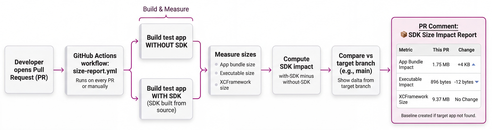

# SDK Size Report

Measures the mParticle SDK's impact on app size by comparing a baseline app (no SDK) against one with the SDK integrated.



## How It Works

1. `measure_size.sh` builds the SDK **from source** into an xcframework
2. Builds two test apps: baseline and with-SDK
3. Reports the size delta

## Usage

```bash
./measure_size.sh          # Human-readable output
./measure_size.sh --json   # JSON output for CI
```

## CI Integration

The `.github/workflows/size-report.yml` workflow runs on PRs to report size changes.
