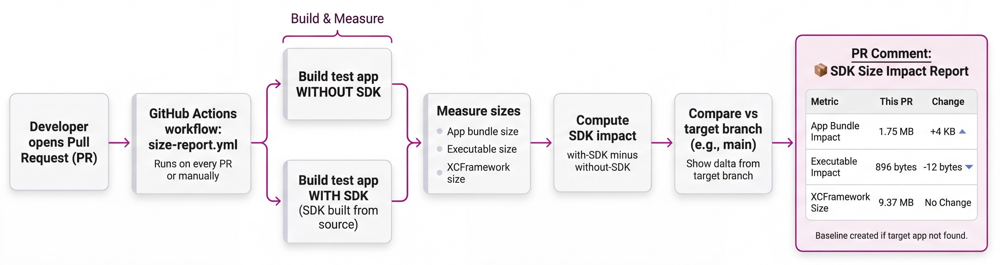

# SDK Size Report

## Overview

Measures the mParticle SDK's impact on app size by comparing a baseline app (no SDK) against one with the SDK integrated.



## How It Works

1. `measure_size.sh` builds the SDK **from source** into an xcframework
2. Builds two test apps: baseline and with-SDK
3. Reports the size delta
4. `analyze_binary.sh` attributes those bytes to segments, sections and modules

## Usage

```bash
./measure_size.sh          # Human-readable output
./measure_size.sh --json   # JSON output for CI

# Attribute the bytes in a built framework
./analyze_binary.sh build/mParticle_Apple_SDK.xcframework/ios-arm64/mParticle_Apple_SDK.framework
./analyze_binary.sh <framework> --json     # aggregates only, for CI
./analyze_binary.sh <framework> --top 50   # 50 largest symbols per image
```

## Reading the numbers

**`App Bundle Impact` is the number that matters.** The SDK ships as a dynamic framework
that the app embeds, so the app's own executable grows by under a kilobyte
(`Executable Impact`) while the framework is carried whole. Nothing in the SDK is
dead-stripped at app link time, which is why this metric tracks compiled code almost 1:1.

**Ignore the XCFramework total.** `xcodebuild -create-xcframework` folds the dSYM in
beside the framework, and Release builds with `dwarf-with-dsym`, so roughly 60% of that
number is debug symbols that never reach a device. `framework_size_kb` is the shipped
part; `dsym_size_kb` is not.

**Consumers who take the SDK as source pay less.** SwiftPM and CocoaPods compile from
source and link statically into the app, where dead-stripping does apply. This harness
measures the binary-xcframework path, which is the worst case.

## Size budget

The migration from Objective-C to Swift raised the SDK's app-bundle impact from
**1,840 KB on `main` to 2,840 KB on `workstation/swift-migration`** (+1,000 KB, +54%).
Measured 2026-09-21 on `main` at `13f53dcf` and `workstation/swift-migration` at `656d3349`,
same machine and toolchain. `main` has measured 1,840 KB on every run since 2026-09-02 and
across two Xcode versions, so it is a stable reference point.

Target: **app-bundle impact must not exceed `main`'s 1,840 KB once the migration is
complete.** Until then, treat every increase as debt that has to be paid down before the
migration branch merges.

`size-report.yml` fails when a PR adds more than `SIZE_DELTA_THRESHOLD_KB` (50 KB) to the
app-bundle impact. Two things to know about that gate:

- The target-branch measurement is `continue-on-error`. When it fails the delta is `N/A`,
  which means "could not verify", not "passed" - the job warns instead of passing quietly.
- The ruleset covering `main` and `workstation/*` requires no status checks, so this gate
  only blocks a merge once someone marks the check required.

## What drives the size

Attribution of the +1,000 KB regression, from `analyze_binary.sh`:

| Component                    | `main`   | `workstation` | Delta     | Share | What moves it                                                           |
| ---------------------------- | -------- | ------------- | --------- | ----- | ----------------------------------------------------------------------- |
| `__text` (code)              | 757.9 KB | 1,332.9 KB    | +575.0 KB | 58%   | Amount of compiled code; `SWIFT_OPTIMIZATION_LEVEL`                     |
| `__LINKEDIT`                 | 528.0 KB | 720.0 KB      | +192.0 KB | 19%   | Number of exported symbols - Swift `public` symbols are `no_dead_strip` |
| `__objc_*` metadata          | 339.6 KB | 459.1 KB      | +119.5 KB | 12%   | Every `@objc` declaration, including those on Swift types               |
| `__swift5_*` metadata        | 12.2 KB  | 56.1 KB       | +43.9 KB  | 4%    | Type metadata and reflection                                            |
| headers, padding, signatures | -        | -             | ~+70 KB   | 7%    | Number of Mach-O images                                                 |

The framework ships as **two** Mach-O images: `mParticle_Apple_SDK.framework` and, nested
inside it, `mParticle_Apple_SDK_Swift.framework`. The second one exists because SwiftPM
cannot mix Objective-C and Swift in one target; it costs a second set of symbol tables and
prevents dead-stripping across the boundary. It collapses on its own once the migration
removes the last `.m` file.

Splitting the regression by image shows how lopsided the trade is. Deleting 11,151 lines of
Objective-C shrank the outer image by 411 KB; adding 16,263 lines of Swift grew the inner one
by 1,409 KB.

| Image                       | `main`     | `workstation` | Delta       | Exported symbols |
| --------------------------- | ---------- | ------------- | ----------- | ---------------- |
| `mParticle_Apple_SDK`       | 1,495.8 KB | 1,085.1 KB    | -410.7 KB   | 1,676 -> 1,532   |
| `mParticle_Apple_SDK_Swift` | 329.9 KB   | 1,738.9 KB    | +1,409.0 KB | 865 -> 4,983     |

## CI Integration

The `.github/workflows/size-report.yml` workflow runs on PRs to report size changes.
